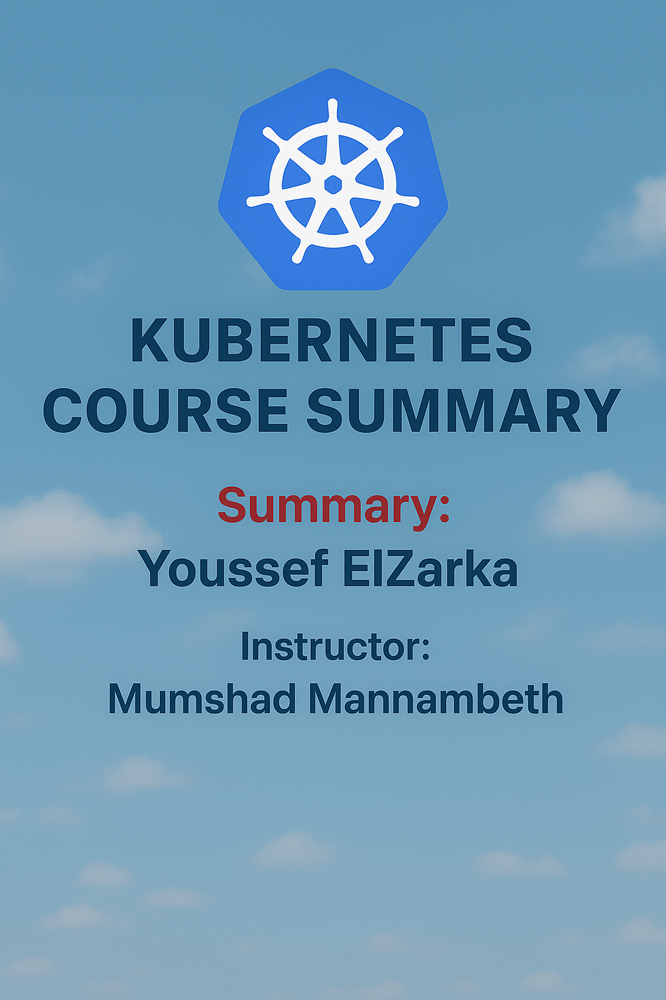

# 🚀 Kubernetes CKA Course Summary

Welcome to the **Certified Kubernetes Administrator (CKA) Course Summary** 📘  
This repository contains a structured summary of all the essential topics you need to prepare for the **CKA Exam**.  
It’s designed to be a quick reference and a study companion.

---

## 📑 Table of Contents

- [🌐 Core Concepts](#-core-concepts)
- [📦 Application Lifecycle Management](#-application-lifecycle-management)
- [🗂️ Scheduling](#️-scheduling)
- [📊 Logging & Monitoring](#-logging--monitoring)
- [🔐 Security](#-security)
- [🛠️ Cluster Maintenance](#️-cluster-maintenance)
- [💾 Storage](#-storage)
- [🌉 Networking](#-networking)
- [⚙️ Install K8s the Hard Way](#️-install-k8s-the-hard-way)
- [⚡ Install K8s with Kubeadm](#-install-k8s-with-kubeadm)
- [✅ End-to-End Tests](#-end-to-end-tests)
- [🩺 Troubleshooting](#-troubleshooting)
- [⭐ Important CKAD Topics](#-important-ckad-topics)
- [📚 Other Topics](#-other-topics)

---

## 🌐 Core Concepts
- Cluster Architecture  
- ETCD Basics & in Kubernetes  
- API Server, Controller Manager, Scheduler  
- Kubelet & Kube Proxy  
- Pods (YAML, ReplicaSets, Deployments)  
- Namespaces & Resource Quotas  
- Services (ClusterIP, NodePort, etc.)  
- Imperative vs Declarative  

---

## 📦 Application Lifecycle Management
- Rolling Updates & Rollbacks  
- Docker Entrypoint & CMD  
- Commands & Args in Kubernetes  
- Environment Variables  
- ConfigMaps & Secrets  
- Multi-Container Pods & Init Containers  

---

## 🗂️ Scheduling
- Manual Scheduling  
- Labels & Selectors  
- Taints, Tolerations & Affinity  
- Resource Requests & Limits  
- DaemonSets, Static Pods  
- Multiple Schedulers  

---

## 📊 Logging & Monitoring
- Monitoring Cluster Components  
- Checking Status & Logs  
- Managing Application Logs  

---

## 🔐 Security
- Authentication & TLS in Kubernetes  
- Certificates & API Access  
- RBAC (Roles, RoleBindings, ClusterRoles)  
- Security Contexts & Image Security  
- Network Policies  

---

## 🛠️ Cluster Maintenance
- Drain, Cordon, Uncordon  
- Upgrades & Versioning  
- Backup & Restore  

---

## 💾 Storage
- Docker Storage & Volume Drivers  
- Container Storage Interface (CSI)  
- Volumes, Persistent Volumes (PV) & Claims (PVC)  

---

## 🌉 Networking
- Intro to Networking & Prerequisites (DNS, CNI, etc.)  
- Cluster & Pod Networking  
- CNI Plugins (Weave, etc.)  
- Service Networking & CoreDNS  
- Ingress Controller  

---

## ⚙️ Install K8s the Hard Way
- Cluster Design & High Availability  
- ETCD Setup  
- Control Plane Components & Load Balancer  
- TLS Bootstrapping & Remote Access  
- Deploying Pod Networking & CoreDNS  

---

## ⚡ Install K8s with Kubeadm
- Introduction & Deployment with Kubeadm  
- Demo & Hands-on Steps  

---

## ✅ End-to-End Tests
- Running Tests with Kubetest  
- Smoke Testing  

---

## 🩺 Troubleshooting
- Application Failures  
- Control Plane Failures  
- Worker Node Failures  

---

## ⭐ Important CKAD Topics
- Readiness & Liveness Probes  
- Jobs & CronJobs  
- StatefulSets & StorageClasses  
- Headless Services  

---

## 📚 Other Topics
- Advanced Kubectl with JSONPath  

---

## 🎓 Author
👤 **CKA Summary Maintainer**  
This repo is maintained as a quick study and revision guide for Kubernetes enthusiasts preparing for the **CKA Exam**.  

---

✨ *Contributions are welcome! Feel free to fork, improve, and share knowledge with the community.* ✨
