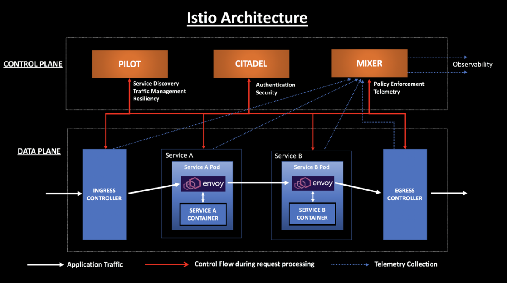

## 🌉 Istio Introduction
- Monolithic vs. Microservice
- Service Mesh	
- Istio	
- Installing Istio – Introduction	
- Demo - Installing Istioctl	
- Installing Istio on your Cluster
- Deploying Our First Application on Istio	
- Demo Deploying Our First Application on Istio	
- Visualizing Service Mesh with Kiali
- Demo Installing Kiali	27
- Demo Create Traffic Into Your Mesh

  

🔙 [Back to README](../README.md)

---
