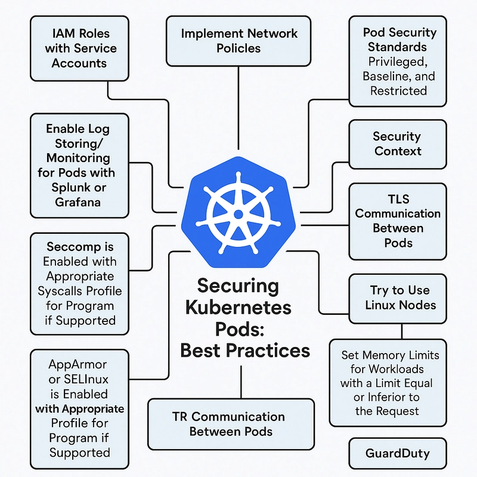

## 🔐 Security
- Authentication & TLS in Kubernetes  
- Certificates & API Access  
- RBAC (Roles, Bindings, ClusterRoles)  
- Security Contexts & Image Security  
- Network Policies

🔙 [Back to README](../README.md)
---
